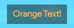
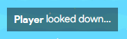
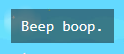

# Styling Text

You are able to style Activity Feed text and Overlays with these tags.

## Colors

**Note: The tags below are the only known ones we have. However, if you find more please add them!**

### Custom Color

⚠️ This isn't currently working, and may have been removed.

<!--  -->

```
<color color='#D36060'>You can use any hex code you'd like, how cool?</color>
```

### Red


```
<red>Red Text!</red>
```

### Orange



```
<orange>Orange Text!</orange>
```

### Green


```
<green>Green Text!</green>
```

## Formatting

### Bold



```
<b>Player</b> looked down...
```

### Italic


```
<i>This text is very important.</i>
```

### Monospace



```
<monospace>Beep boop.</monospace>
```
